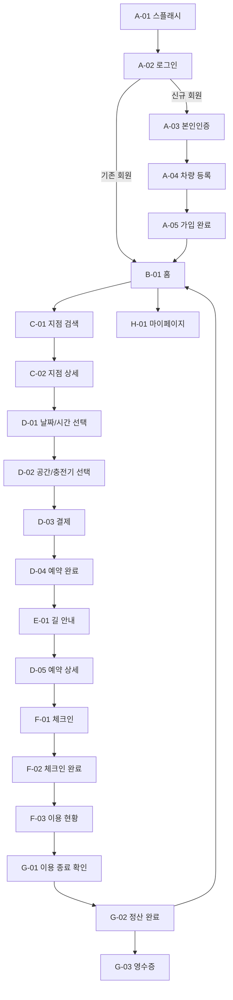
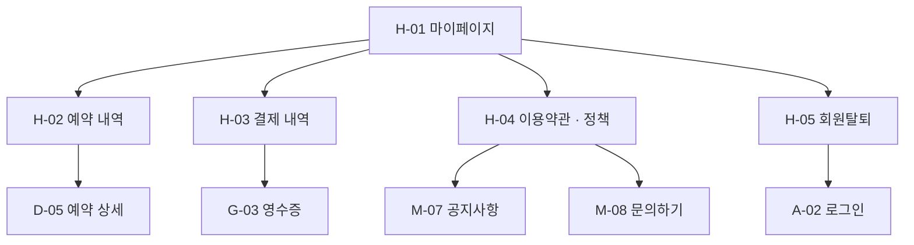

# Deep Space 서비스 플로우

> 버전: v1.0  
> 작성일: 2026.04.23  
> 기준: 현재 구현된 프로토타입 (`A-01 ~ H-05`, `M-01 ~ M-08`)

---

## 문서 목적

- Deep Space 모바일 앱의 전체 서비스 흐름을 화면 ID 기준으로 정리한다.
- 기획, 디자인, 프로토타입, 발표 자료가 같은 플로우 기준을 공유하도록 맞춘다.
- 메인 플로우와 주요 분기, Push 트리거, 마이페이지/정책/탈퇴 흐름까지 한 문서에 모은다.

---

## 범위

- 메인 화면: 28개
- 모달/시트: 6개
- 총 관리 대상 화면: 34개

| 구간 | 화면 |
|------|------|
| 인증/온보딩 | A-01 ~ A-05 |
| 홈/알림 | B-01 ~ B-02 |
| 지점 검색 | C-01 ~ C-03 |
| 예약 | D-01 ~ D-05 |
| 길 안내 | E-01 |
| 체크인/이용 | F-01 ~ F-04 |
| 퇴실/정산 | G-01 ~ G-03 |
| 마이페이지 | H-01 ~ H-05 |
| 공통 시트 | M-01, M-03, M-04, M-05, M-07, M-08 |

---

## 서비스 메인 플로우

---

## 단계별 서비스 흐름

| 단계 | 목적 | 주요 화면 | 핵심 액션 |
|------|------|-----------|-----------|
| 1 | 앱 진입/인증 | A-01, A-02 | 스플래시 진입, 소셜 로그인 |
| 2 | 신규 가입 | A-03, A-04, A-05 | 본인확인, 차량 등록, 권한 설정 |
| 3 | 홈 탐색 | B-01, B-02 | 근처 지점 확인, 알림 확인 |
| 4 | 지점 선택 | C-01, C-02, C-03 | 지도/검색으로 지점 탐색, 상세 확인 |
| 5 | 예약 | D-01, D-02, D-03, D-04 | 시간 선택, 좌석/충전기 선택, 결제 |
| 6 | 도착 준비 | E-01, M-04 | 내비 선택, 도착 배터리/주차 위치 확인 |
| 7 | 현장 진입 | D-05 | 지오펜스 Push 후 예약 상세/위치 약도 확인 |
| 8 | 체크인 | F-01, F-02 | QR 또는 출입번호로 체크인 |
| 9 | 이용 | F-03, F-04, M-05 | 충전 상태 확인, 시간 연장, 이용 종료 |
| 10 | 정산 | G-01, G-02, G-03 | 종료 확인, 정산, 영수증 확인 |
| 11 | 계정/정책 | H-01 ~ H-05, M-07, M-08 | 예약 내역, 결제 내역, 약관, 문의, 탈퇴 |

---

## 예약-이용 핵심 플로우

---

## 마이페이지/관리 플로우

---

## Push/자동 트리거 플로우

| 구간 | 트리거 | 진입 화면 | 후속 플로우 |
|------|--------|-----------|-------------|
| 예약 확정 | D-03 결제 완료 | D-04 | 예약 상세 또는 길 안내로 이동 |
| 반경 진입 | 지오펜스 500m 진입 | D-05 | 위치 약도 확인 후 체크인 |
| 체크인 완료 | F-01 성공 처리 | F-02 | 이용 현황 진입 |
| 종료 임박 | 종료 10분 전 | F-03 / M-05 | 연장 또는 종료 준비 |
| 정산 완료 | G-02 완료 | G-02 | 영수증 확인, 홈 복귀 |

---

## 주요 분기 포인트

| 구간 | 분기 | 현재 연결 화면 |
|------|------|----------------|
| 로그인 | 기존 회원 / 신규 회원 | A-02 -> B-01 또는 A-03 |
| 지점 탐색 | 지도 탐색 / 텍스트 검색 | C-01 <-> C-03 |
| 지점 상세 | 예약 / 길 안내 / 좌석배치도 | C-02 -> D-01, E-01, M-01 |
| 예약 상세 | 길 안내 / 체크인 / 취소 | D-05 -> E-01, F-01, M-03 |
| 체크인 | QR / 출입번호 | F-01 탭 전환 |
| 이용 중 | 연장 / 종료 / 충전 상세 | F-03 -> M-05, G-01, F-04 |
| 마이페이지 | 내역 / 정책 / 문의 / 탈퇴 | H-01 -> H-02, H-03, H-04, H-05, M-08 |

---

## 시트/모달 매핑

| 화면 ID | 이름 | 부모 화면 | 용도 |
|---------|------|-----------|------|
| M-01 | 좌석 배치도 | D-02 | 좌석/충전기 위치 확인 |
| M-03 | 예약 취소 확인 | D-05 | 예약 취소 의사 재확인 |
| M-04 | 내비 앱 선택 | E-01 | 외부 내비 전환 |
| M-05 | 시간 연장 | F-03 | 이용 시간 연장 |
| M-07 | 공지사항 상세 | H-01 / H-04 | 운영 정책/공지 열람 |
| M-08 | 문의하기 | H-01 / H-04 | 문의 접수 |

---

## 현재 프로토타입 기준 메인 발표 플로우

발표/시연 기준 추천 순서는 아래입니다.

1. `A-01 -> A-02 -> A-03 -> A-04 -> A-05`
2. `B-01 -> C-01 -> C-02`
3. `D-01 -> D-02 -> D-03 -> D-04`
4. `E-01 -> D-05 -> F-01 -> F-02`
5. `F-03 -> M-05 -> G-01 -> G-02 -> G-03`
6. `H-01 -> H-04 -> H-05`

---

## 정리

- 서비스 전체 중심축은 `탐색 -> 예약 -> 길안내 -> 체크인 -> 이용 -> 정산`이다.
- 운영 신뢰도를 만드는 보조축은 `Push`, `정책/문의`, `예약 취소`, `회원탈퇴`다.
- 현재 프로토타입은 메인 플로우뿐 아니라 마이페이지 정책/탈퇴까지 포함한 검토 가능한 수준이다.
