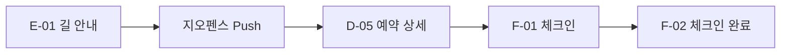
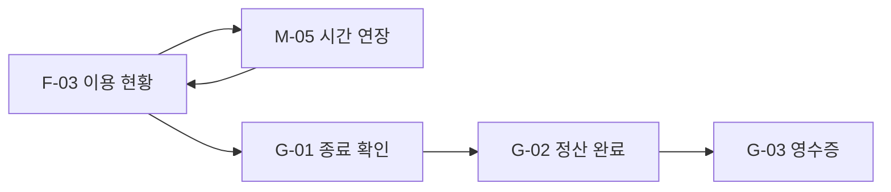
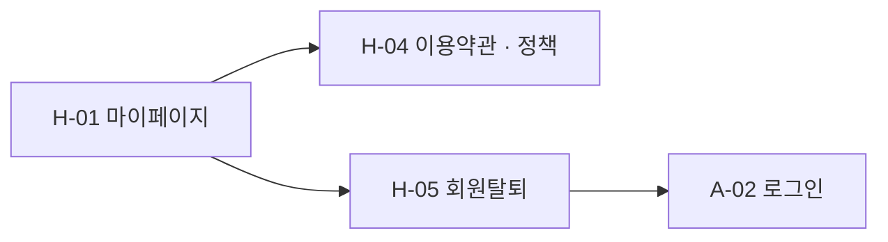

# Deep Space 핵심 유저 플로우

> 버전: v1.0  
> 작성일: 2026.04.23  
> 기준: 현재 구현된 프로토타입 화면 및 인터랙션

---

## 문서 목적

- 발표, 리뷰, 내부 합의에 바로 사용할 수 있는 핵심 사용자 시나리오를 정리한다.
- 각 시나리오를 화면 ID 기준으로 연결해 프로토타입 검증 기준을 만든다.
- “정상 플로우”와 “운영 설득력 있는 플로우”를 분리해 본다.

---

## 시나리오 목록

| # | 시나리오 | 시작 화면 | 종료 화면 |
|---|----------|-----------|-----------|
| 1 | 신규 가입 후 첫 예약 | A-01 | D-04 |
| 2 | 기존 회원 빠른 예약 | B-01 | D-04 |
| 3 | 반경 진입 Push 후 체크인 | E-01 | F-02 |
| 4 | 출입번호 체크인 | F-01 | F-02 |
| 5 | 이용 중 시간 연장 후 정산 | F-03 | G-03 |
| 6 | 예약 취소 | D-05 | M-03 |
| 7 | 정책 확인 및 회원탈퇴 | H-01 | A-02 |

---

## 1. 신규 가입 후 첫 예약

**목표**  
처음 앱을 설치한 사용자가 가입, 차량 등록, 예약 완료까지 도달한다.

**화면 경로**  
`A-01 -> A-02 -> A-03 -> A-04 -> A-05 -> B-01 -> C-01 -> C-02 -> D-01 -> D-02 -> D-03 -> D-04`

```mermaid
flowchart LR
    A01[A-01 스플래시] --> A02[A-02 로그인]
    A02 --> A03[A-03 본인인증]
    A03 --> A04[A-04 차량 등록]
    A04 --> A05[A-05 가입 완료]
    A05 --> B01[B-01 홈]
    B01 --> C01[C-01 지점 검색]
    C01 --> C02[C-02 지점 상세]
    C02 --> D01[D-01 날짜/시간]
    D01 --> D02[D-02 공간/충전기]
    D02 --> D03[D-03 결제]
    D03 --> D04[D-04 예약 완료]
```

**검토 포인트**

- 회원가입 중 약관/본인인증/차량등록 문구가 자연스러운지
- 차량 등록의 가치가 예약과 체크인에서 명확히 이어지는지
- 예약 완료 시 “충전+업무” 가치가 한 문장으로 정리되는지

---

## 2. 기존 회원 빠른 예약

**목표**  
로그인된 기존 사용자가 홈에서 빠르게 지점 예약까지 진행한다.

**화면 경로**  
`B-01 -> C-01 -> C-02 -> D-01 -> D-02 -> D-03 -> D-04`

**대표 액션**

- 홈의 근처 지점/예약 진입
- 시간 선택
- 좌석/충전기 선택
- 결제 수단 선택
- 예약 완료 확인

**운영 포인트**

- 홈에서 예약까지 클릭 수가 과도하지 않은지
- `D-02`에서 좌석/충전기 선택이 혼란스럽지 않은지
- `D-03`에서 금액과 결제 수단 우선순위가 명확한지

---

## 3. 반경 진입 Push 후 체크인

**목표**  
차량 이동 중 사용자가 지점 반경 진입 Push를 받고, 예약 상세를 거쳐 체크인 준비까지 도달한다.

**화면 경로**  
`E-01 -> Push -> D-05 -> F-01 -> F-02`

**검토 포인트**

- Push 문구만으로도 사용자가 다음 액션을 이해하는지
- 예약 상세에서 주차장 위치/입차 위치 안내가 충분한지
- 체크인 버튼 활성 시점이 현실적인지

---

## 4. 출입번호 체크인

**목표**  
QR 대신 출입번호를 이용해 체크인하는 보조 플로우를 검증한다.

**화면 경로**  
`F-01 (출입번호 탭) -> F-02`

**세부 조건**

- `출입번호` 탭 선택
- 4자리 번호 확인
- 유효시간 확인
- 체크인 완료 처리

**검토 포인트**

- 번호가 실제 키패드용 정보로 읽히는지
- QR 대비 보조 수단으로서 충분히 명확한지
- 탭 전환 시 UI가 안정적으로 바뀌는지

---

## 5. 이용 중 시간 연장 후 정산

**목표**  
이용 중 잔여시간을 확인하고, 연장 후 최종 정산까지 자연스럽게 이어지는지 검증한다.

**화면 경로**  
`F-03 -> M-05 -> F-03 -> G-01 -> G-02 -> G-03`

**검토 포인트**

- 연장 옵션의 가격/종료 시점이 직관적인지
- 연장 불가 상태가 충분히 설득력 있게 보이는지
- 정산 완료 화면이 단순 영수증을 넘어 서비스 가치 요약을 주는지

---

## 6. 예약 취소

**목표**  
예약 시작 전 사용자가 예약을 취소하는 흐름을 확인한다.

**화면 경로**  
`D-05 -> M-03`

**대표 액션**

- 예약 상세 진입
- 취소 버튼 탭
- 환불 예정 금액 확인
- 취소 요청 또는 돌아가기

**검토 포인트**

- 무료 취소 기준이 충분히 보이는지
- 환불 예정 금액과 충전 실비 정보가 이해되는지
- 시트 CTA 위계가 파괴적 액션에 맞게 잡혀 있는지

---

## 7. 정책 확인 및 회원탈퇴

**목표**  
마이페이지에서 정책 열람과 계정 종료 플로우가 독립적으로 성립하는지 확인한다.

**화면 경로**  
`H-01 -> H-04 -> H-05 -> A-02`

**검토 포인트**

- 약관/정책 화면이 단순 링크 모음이 아니라 읽을 만한 허브로 보이는지
- 회원탈퇴 화면이 삭제 범위와 주의사항을 충분히 설명하는지
- 탈퇴 CTA가 과하게 가볍거나 반대로 과하게 숨겨지지 않았는지

---

## 발표용 추천 플로우 묶음

### 플로우 A. 가치 제안 중심

`A-01 -> A-05 -> B-01 -> C-02 -> D-04`

가입부터 예약 완료까지 보여주며 서비스 컨셉을 설명하기 좋다.

### 플로우 B. 현장 경험 중심

`E-01 -> D-05 -> F-01 -> F-02 -> F-03`

도착, 체크인, 이용 현황까지 실제 앱 감각을 보여주기 좋다.

### 플로우 C. 운영 완성도 중심

`F-03 -> M-05 -> G-02 -> G-03 -> H-04 -> H-05`

연장, 정산, 정책, 탈퇴까지 이어져 서비스 운영 신뢰도를 설명하기 좋다.

---

## 정리

- 핵심 유저 플로우의 중심은 `예약`, `현장 진입`, `체크인`, `이용`, `정산`이다.
- 설득력을 높이는 보조 플로우는 `예약 취소`, `정책`, `회원탈퇴`다.
- 발표 시에는 전체를 다 보여주기보다 목적별로 2~3개 플로우 묶음으로 나눠 시연하는 편이 효율적이다.
